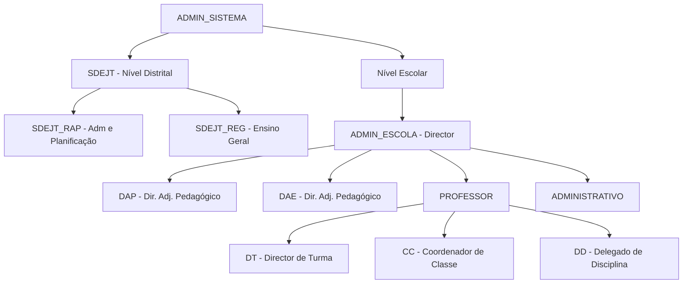

# 📋 Perfis de Usuário e Especificação de Telas - SalamandraSGE

## 👥 Hierarquia de Usuários



---

## 1. 🔐 ADMIN_SISTEMA (Administrador do Sistema)

### Responsabilidades
- Gestão completa de todas as escolas do sistema
- Criação e gestão de distritos
- Acesso total a todos os dados
- Bypass de bloqueios escolares

### Permissões
- ✅ Acesso total a todas as escolas
- ✅ Criar/editar/deletar qualquer recurso
- ✅ Ignorar bloqueios de escola
- ✅ Visualizar estatísticas globais

### Telas Sugeridas

#### 1.1 Dashboard Global
- **Rota**: `/admin/dashboard`
- **Conteúdo**:
  - Total de escolas por distrito
  - Total de alunos no sistema
  - Escolas bloqueadas/ativas
  - Gráficos de aproveitamento por distrito

#### 1.2 Gestão de Distritos
- **Rota**: `/admin/distritos`
- **Funcionalidades**:
  - Listar todos os distritos
  - Criar novo distrito
  - Editar/deletar distrito
  - Ver escolas por distrito

#### 1.3 Gestão de Escolas (Global)
- **Rota**: `/admin/escolas`
- **Funcionalidades**:
  - Listar todas as escolas
  - Filtrar por distrito, tipo, status
  - Criar nova escola
  - Bloquear/desbloquear escola
  - Ver detalhes completos

---

## 2. 🏛️ SDEJT - Serviço Distrital de Educação

### 2.1 SDEJT_RAP (Repartição de Administração e Planificação)

#### Responsabilidades
- Gestão administrativa das escolas do distrito
- Criação de novas escolas
- Planificação de recursos

#### Permissões
- ✅ Ver escolas do seu distrito
- ✅ Criar novas escolas no distrito
- ✅ Editar informações escolares
- ❌ Não pode acessar outros distritos

#### Telas Sugeridas

**Dashboard Distrital**
- **Rota**: `/sdejt/dashboard`
- **Conteúdo**:
  - Escolas do distrito
  - Total de alunos por escola
  - Recursos alocados
  - Botão "Criar Nova Escola"

**Gestão de Escolas (Distrito)**
- **Rota**: `/sdejt/escolas`
- **Funcionalidades**:
  - Listar escolas do distrito
  - Criar nova escola
  - Editar detalhes
  - Ver estatísticas por escola

### 2.2 SDEJT_REG (Repartição de Ensino Geral)

#### Responsabilidades
- Supervisão pedagógica das escolas
- Análise de aproveitamento escolar
- Relatórios educacionais

#### Permissões
- ✅ Ver escolas do distrito
- ✅ Criar escolas
- ✅ Visualizar relatórios pedagógicos
- ❌ Não pode acessar outros distritos

#### Telas Sugeridas

**Dashboard Pedagógico**
- **Rota**: `/sdejt/pedagogico`
- **Conteúdo**:
  - Aproveitamento por escola
  - Comparativo de médias
  - Escolas com baixo desempenho
  - Relatórios trimestrais

---

## 3. 🏫 ADMIN_ESCOLA (Director da Escola)

### Responsabilidades
- Gestão completa da escola
- Bloquear/desbloquear escola
- Dashboard com estatísticas
- Supervisão de todos os setores

### Permissões
- ✅ Ver dados da sua escola
- ✅ Bloquear/desbloquear escola
- ✅ Acesso mesmo com escola bloqueada
- ✅ Ver dashboard completo
- ❌ Não pode ver outras escolas

### Telas Sugeridas

#### 3.1 Dashboard do Director
- **Rota**: `/director/dashboard`
- **Conteúdo**:
  - Total de alunos, docentes, técnicos
  - Aproveitamento por classe
  - Aproveitamento por disciplina
  - Botão "Bloquear/Desbloquear Escola"
  - Status da escola (bloqueada/ativa)

#### 3.2 Gestão de Recursos
- **Rota**: `/director/recursos`
- **Funcionalidades**:
  - Ver todos os professores
  - Ver todos os funcionários
  - Ver todas as turmas
  - Relatórios gerais

#### 3.3 Configurações da Escola
- **Rota**: `/director/configuracoes`
- **Funcionalidades**:
  - Editar detalhes da escola
  - Configurar ano letivo
  - Gerenciar bloqueio

---

## 4. 📚 DAP (Director Adjunto Pedagógico)

### Responsabilidades
- Coordenação pedagógica
- Supervisão de professores
- Análise de aproveitamento

### Permissões
- ✅ Ver dados pedagógicos da escola
- ✅ Visualizar relatórios
- ⚠️ Bloqueado se escola bloqueada (só leitura)

### Telas Sugeridas

**Dashboard Pedagógico**
- **Rota**: `/dap/dashboard`
- **Conteúdo**:
  - Aproveitamento por turma
  - Professores e suas disciplinas
  - Calendário de avaliações
  - Relatórios de desempenho

---

## 5. 🎓 DAE (Director Adjunto de Escola)

### Responsabilidades
- Atribuir cargos de confiança (DT, CC, DD)
- Estatísticas de alunos e disciplinas
- Gestão de aproveitamento

### Permissões
- ✅ Atribuir cargos a professores
- ✅ Ver estatísticas completas
- ✅ Acesso a relatórios
- ⚠️ Bloqueado se escola bloqueada

### Telas Sugeridas

#### 5.1 Dashboard DAE
- **Rota**: `/dae/dashboard`
- **Conteúdo**:
  - Estatísticas de alunos
  - Estatísticas de disciplinas
  - Aproveitamento geral

#### 5.2 Gestão de Cargos
- **Rota**: `/dae/cargos`
- **Funcionalidades**:
  - Atribuir DT (Director de Turma)
  - Atribuir CC (Coordenador de Classe)
  - Atribuir DD (Delegado de Disciplina)
  - Ver cargos ativos
  - Remover cargos

**Formulário de Atribuição**:
```json
{
  "professor_id": 1,
  "cargo_tipo": "DT",
  "entidade_id": 10,
  "ano_letivo": 2026
}
```

---

## 6. 👨‍🏫 PROFESSOR

### Responsabilidades Base
- Lançar notas dos alunos
- Lançar faltas
- Ver turmas que leciona

### Permissões
- ✅ Lançar notas (ACS, MAP, ACP)
- ✅ Lançar faltas
- ✅ Ver alunos das suas turmas
- ⚠️ Bloqueado se escola bloqueada

### Telas Sugeridas

#### 6.1 Dashboard Professor
- **Rota**: `/professor/dashboard`
- **Conteúdo**:
  - Minhas turmas
  - Disciplinas que leciono
  - Próximas avaliações
  - Estatísticas rápidas

#### 6.2 Lançamento de Notas
- **Rota**: `/professor/notas`
- **Funcionalidades**:
  - Selecionar turma
  - Selecionar disciplina
  - Selecionar trimestre
  - Tipo de avaliação (ACS, MAP, ACP)
  - Lançar nota por aluno
  - Ver histórico de notas

#### 6.3 Lançamento de Faltas
- **Rota**: `/professor/faltas`
- **Funcionalidades**:
  - Selecionar turma
  - Selecionar data
  - Marcar faltas (Justificada/Injustificada)
  - Ver histórico de faltas

### 6.1 🎯 DT - Director de Turma (Cargo Especial)

#### Responsabilidades Adicionais
- Gestão completa da turma atribuída
- Acompanhamento de alunos
- Estatísticas da turma

#### Permissões Adicionais
- ✅ Ver estatísticas completas da turma
- ✅ Ver todos os alunos da turma
- ✅ Acompanhar aproveitamento

#### Telas Específicas

**Minha Turma**
- **Rota**: `/dt/minha-turma`
- **Conteúdo**:
  - Nome da turma e classe
  - Lista completa de alunos
  - Estatísticas de aproveitamento
  - Faltas por aluno
  - Comportamento geral

**Alunos da Turma**
- **Rota**: `/dt/alunos`
- **Funcionalidades**:
  - Ver detalhes de cada aluno
  - Histórico de notas
  - Histórico de faltas
  - Observações

### 6.2 📊 CC - Coordenador de Classe (Cargo Especial)

#### Responsabilidades Adicionais
- Coordenar todas as turmas da classe
- Inscrever novos alunos
- Análise de aproveitamento da classe

#### Permissões Adicionais
- ✅ Ver resumo de todas as turmas da classe
- ✅ Inscrever alunos na classe
- ✅ Ver estatísticas da classe

#### Telas Específicas

**Resumo da Classe**
- **Rota**: `/cc/resumo`
- **Conteúdo**:
  - Todas as turmas da classe
  - Total de alunos por turma
  - Aproveitamento por turma
  - Comparativo de desempenho

**Inscrição de Alunos**
- **Rota**: `/cc/inscrever`
- **Funcionalidades**:
  - Formulário de inscrição
  - Atribuir turma
  - Validar dados

### 6.3 📖 DD - Delegado de Disciplina (Cargo Especial)

#### Responsabilidades Adicionais
- Coordenar ensino da disciplina
- Análise de aproveitamento na disciplina
- Supervisão de professores da disciplina

#### Permissões Adicionais
- ✅ Ver estatísticas da disciplina
- ✅ Ver todos os professores que lecionam
- ✅ Análise comparativa

#### Telas Específicas

**Resumo da Disciplina**
- **Rota**: `/dd/resumo`
- **Conteúdo**:
  - Aproveitamento por turma
  - Professores que lecionam
  - Médias gerais
  - Identificar turmas com dificuldades

---

## 7. 💼 ADMINISTRATIVO (Sector Administrativo)

### Responsabilidades
- Gestão de alunos (inscrição, transferência, movimentação)
- Formar turmas automaticamente
- Seed de disciplinas
- Gestão de funcionários

### Permissões
- ✅ Inscrever alunos
- ✅ Transferir alunos
- ✅ Mover alunos entre turmas
- ✅ Formar turmas automaticamente
- ✅ Criar disciplinas (seed)
- ✅ Gerir funcionários
- ⚠️ Bloqueado se escola bloqueada

### Telas Sugeridas

#### 7.1 Dashboard Administrativo
- **Rota**: `/admin-escolar/dashboard`
- **Conteúdo**:
  - Total de alunos ativos
  - Alunos por turma
  - Funcionários registados
  - Ações rápidas

#### 7.2 Gestão de Alunos
- **Rota**: `/admin-escolar/alunos`
- **Funcionalidades**:
  - Listar todos os alunos
  - Inscrever novo aluno
  - Editar dados do aluno
  - Transferir aluno (desativar)
  - Mover aluno entre turmas
  - Filtros (classe, turma, status)

#### 7.3 Formação de Turmas
- **Rota**: `/admin-escolar/formar-turmas`
- **Funcionalidades**:
  - Selecionar classe
  - Definir ano letivo
  - Configurar min/max alunos por turma
  - Executar distribuição automática
  - Ver resultado

**Payload**:
```json
{
  "classe_id": 1,
  "ano_letivo": 2026,
  "min_alunos": 20,
  "max_alunos": 50
}
```

#### 7.4 Gestão de Disciplinas
- **Rota**: `/admin-escolar/disciplinas`
- **Funcionalidades**:
  - Listar disciplinas
  - Seed Primária (criar todas as disciplinas do currículo primário)
  - Seed Secundária (criar disciplinas do secundário)
  - Editar/deletar disciplina

#### 7.5 Gestão de Funcionários
- **Rota**: `/admin-escolar/funcionarios`
- **Funcionalidades**:
  - Listar funcionários
  - Registar novo funcionário
  - Editar dados
  - Avaliações de desempenho

---

## 📊 Telas Comuns a Todos

### Login
- **Rota**: `/login`
- **Campos**: Email, Password
- **Redirecionamento**: Baseado no role do usuário

### Relatórios
- **Rota**: `/relatorios`
- **Funcionalidades**:
  - Pauta Trimestral (turma + disciplina)
  - Resumo da Escola
  - Exportar PDF/Excel

### Perfil
- **Rota**: `/perfil`
- **Conteúdo**:
  - Dados pessoais
  - Escola/Distrito
  - Alterar senha
  - Logout

---

## 🎨 Sugestão de Estrutura de Navegação

### ADMIN_SISTEMA
```
Dashboard Global
├── Distritos
├── Escolas
├── Estatísticas Globais
└── Configurações
```

### SDEJT (RAP/REG)
```
Dashboard Distrital
├── Escolas do Distrito
├── Criar Escola
├── Relatórios
└── Estatísticas
```

### ADMIN_ESCOLA
```
Dashboard Director
├── Recursos Humanos
├── Gestão Académica
├── Relatórios
├── Configurações
└── Bloquear Escola
```

### DAE
```
Dashboard DAE
├── Atribuir Cargos
├── Estatísticas
└── Relatórios
```

### PROFESSOR
```
Dashboard Professor
├── Minhas Turmas
├── Lançar Notas
├── Lançar Faltas
└── [Se DT] Minha Turma
└── [Se CC] Coordenação de Classe
└── [Se DD] Delegação de Disciplina
```

### ADMINISTRATIVO
```
Dashboard Administrativo
├── Gestão de Alunos
├── Formar Turmas
├── Disciplinas
├── Funcionários
└── Relatórios
```

---

## 🔒 Regras de Bloqueio de Escola

Quando uma escola está **bloqueada**:

- ✅ **ADMIN_SISTEMA**: Acesso total
- ✅ **ADMIN_ESCOLA**: Acesso total (para desbloquear)
- ⚠️ **Outros usuários**: Apenas leitura (GET)
- ❌ **Não podem**: Criar, editar, deletar

**Implementação no Frontend**:
- Verificar `user.school.blocked`
- Desabilitar botões de ação
- Mostrar mensagem de escola bloqueada
- Permitir apenas visualização

---

## 📝 Resumo de Endpoints por Role

| Role | Principais Endpoints |
|------|---------------------|
| ADMIN_SISTEMA | Todos |
| SDEJT_RAP/REG | `/api/instituicoes/schools/` (distrito) |
| ADMIN_ESCOLA | `/api/instituicoes/director/dashboard/`, `/api/instituicoes/director/bloquear_escola/` |
| DAE | `/api/academico/dae/atribuir_cargo/`, `/api/academico/dae/estatisticas_*` |
| DT | `/api/academico/director-turma/minha_turma/`, `/api/academico/director-turma/alunos/` |
| CC | `/api/academico/coordenador-classe/resumo_classe/`, `/api/academico/coordenador-classe/inscrever_aluno/` |
| DD | `/api/academico/delegado-disciplina/resumo_disciplina/` |
| PROFESSOR | `/api/avaliacoes/notas/`, `/api/avaliacoes/faltas/` |
| ADMINISTRATIVO | `/api/academico/alunos/`, `/api/academico/turmas/formar_turmas/`, `/api/academico/disciplinas/seed_*` |

---

## 🚀 Prioridade de Implementação

### Fase 1 (Essencial)
1. ✅ Login
2. ✅ Dashboard (ADMIN_ESCOLA)
3. ✅ Gestão de Alunos (ADMINISTRATIVO)
4. ✅ Lançamento de Notas (PROFESSOR)
5. ✅ Relatórios (Pauta)

### Fase 2 (Importante)
6. Dashboard DAE
7. Atribuir Cargos (DAE)
8. Formar Turmas (ADMINISTRATIVO)
9. Gestão de Disciplinas
10. DT - Minha Turma

### Fase 3 (Complementar)
11. SDEJT - Gestão Distrital
12. CC - Coordenação de Classe
13. DD - Delegação de Disciplina
14. Gestão de Funcionários
15. ADMIN_SISTEMA - Dashboard Global
